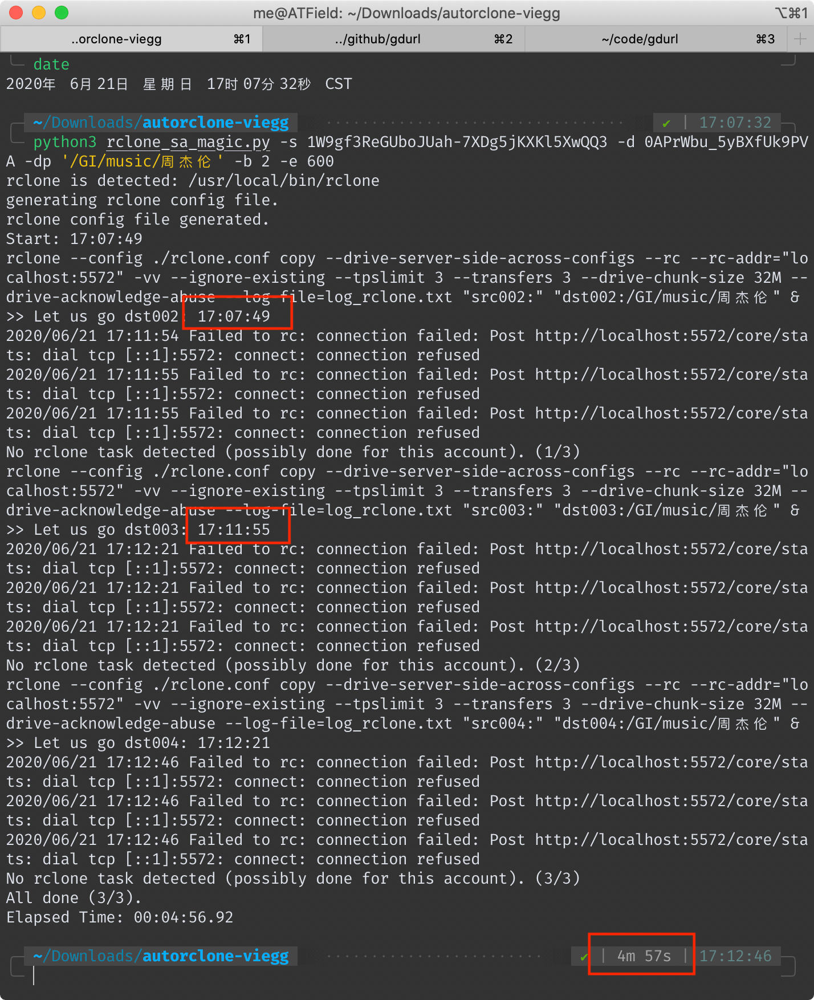

# 對比本工具和其他類似工具在 server side copy 的速度上的差異
### 這裡使用機器翻譯直接簡轉繁, 大家看得懂就好: )
以拷貝[https://drive.google.com/drive/folders/1W9gf3ReGUboJUah-7XDg5jKXKl5XwQQ3](https://drive.google.com/drive/folders/1W9gf3ReGUboJUah-7XDg5jKXKl5XwQQ3)為例（[文件統計](https://gdurl.viegg.com/api/gdrive/count?fid=1W9gf3ReGUboJUah-7XDg5jKXKl5XwQQ3)）  
共 242 個文件和 26 個文件夾

如無特殊說明，以下運行環境都是在本地命令行（掛代理）

## 本工具耗時 40 秒
<!--    -->

另外我在一台洛杉磯的vps上執行相同的命令，耗時23秒。
這個速度是在使用本項目默認配置**20個並行請求**得出來的，此值可自行修改（下文有方法），並行請求數越大，總速度越快。

## AutoRclone 耗時 4 分 57 秒（去掉拷貝後驗證時間 4 分 6 秒）
<!--  -->

## gclone 耗時 3 分 7 秒
<!--  -->

## 為什麽速度會有這麽大差異
首先要明確一下 server side copy（後稱ssc） 的原理。

對於 Google Drive 本身而言，它不會因為你ssc覆制了一份文件而真的去在自己的文件系統上覆制一遍（否則不管它有多大硬盤都會被填滿），它只是在數據庫里添上了一筆記錄。

所以，無論ssc一份大文件還是小文件，理論上它的耗時都是一樣的。
各位在使用這些工具的時候也可以感受到，覆制一堆小文件比覆制幾個大文件要慢得多。

Google Drive 官方的 API 只提供了覆制單個文件的功能，無法直接覆制整個文件夾。甚至也無法讀取整個文件夾，只能讀取某個文件夾的第一層子文件（夾）信息，類似 Linux 命令行里的 `ls` 命令。

這三個工具的ssc功能，本質上都是對[官方file copy api](https://developers.google.com/drive/api/v3/reference/files/copy)的調用。

然後說一下本工具的原理，其大概步驟如下：

- 首先，它會遞歸讀取要覆制的目錄里的所有文件和文件夾的信息，並保存到本地。
- 然後，將所有文件夾對象過濾出來，再根據彼此的父子關系，創建新的同名文件夾，還原出原始結構。（在保證速度的同時保持原始文件夾結構不變，這真的費了一番功夫）
- 根據上一步創建文件夾時留下的新舊文件夾ID的對應關系，調用官方API覆制文件。

得益於本地數據庫的存在，它可以在任務中斷後從斷點繼續執行。比如用戶按下`ctrl+c`後，可以再執行一遍相同的拷貝命令，本工具會給出三個選項：
<!--  -->

另外兩個工具也支持斷點續傳，它們是怎樣做到的呢？AutoRclone是用python對rclone命令的一層封裝，gclone是基於rclone的魔改。
對了——值得一提的是——本工具是直接調用的官方API，不依賴於rclone。

我沒有仔細閱讀過rclone的源碼，但是從它的執行日志中可以大概猜出其工作原理。
先補充個背景知識：對於存在於Google drive的所有文件（夾）對象，它們的一生都伴隨著一個獨一無二的ID，就算一個文件是另一個的拷貝，它們的ID也不一樣。

所以rclone是怎麽知道哪些文件拷貝過，哪些沒有呢？如果它沒有像我一樣將記錄保存在本地數據庫的話，那麽它只能在同一路徑下搜索是否存在同名文件，如果存在，再比對它們的 大小/修改時間/md5值 等判斷是否拷貝過。

也就是說，在最壞的情況下（假設它沒做緩存），它每拷貝一個文件之前，都要先調用官方API來搜索判斷此文件是否已存在！

此外，AutoRclone和gclone雖然都支持自動切換service account，但是它們執行拷貝任務的時候都是單一SA在調用API，這就注定了它們不能把請求頻率調太高——否則可能觸发限制。

而本工具同樣支持自動切換service account，區別在於它的每次請求都是隨機選一個SA，我的[文件統計](https://gdurl.viegg.com/api/gdrive/count?fid=1W9gf3ReGUboJUah-7XDg5jKXKl5XwQQ3)接口就用了20個SA的token，同時請求數設置成20個，也就是平均而言，單個SA的並发請求數只有一次。

所以瓶頸不在於SA的頻率限制，而在運行的vps或代理上，各位可以根據各自的情況適當調整 PARALLEL_LIMIT 的值（在 `config.js` 里）。

當然，如果某個SA的單日流量超過了750G，會自動切換成別的SA，同時過濾掉流量用盡的SA。當所有SA流量用完後，會切換到個人的access token，直到流量同樣用盡，最終進程退出。

*使用SA存在的限制：除了每日流量限制外，其實每個SA還有個**15G的個人盤空間限額**，也就是說你每個SA最多能拷貝15G的文件到個人盤，但是拷貝到團隊盤則無此限制。*
